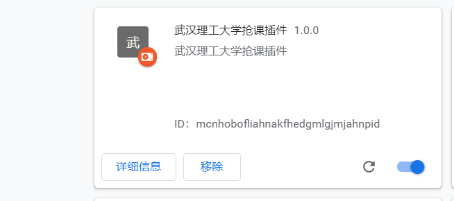
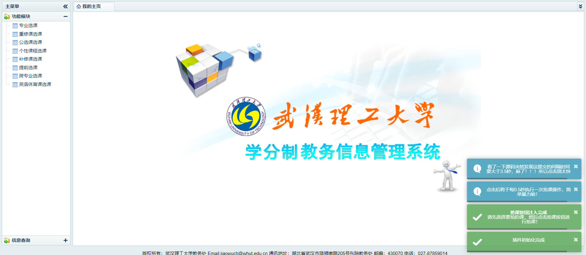
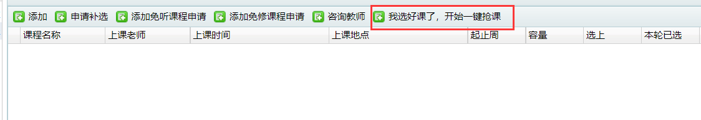

# 1.说明

wut 的选课系统就不多说，动不动就崩了，所以为了加快选课的速度，我去 github 上寻找黑科技，结果淘到了一个学长写的教务选课代码，结果 amazing 呀！！！他居然可以运行，并且帮我选了一些我不能选的课，结果还没有被筛掉，amazing!!!!!!但是原来的程序没有屏蔽那个 20s 的倒计时，有点浪费时间，所以我就去优化了一下，具体优化如下：

① 隐藏了 20s 的倒计时，终于可以一进入系统就可以选课了，不用傻傻的等待 20s 了！！！！

② 去掉了提示窗口，学校的 lj 选课，动不动就“提交过于频繁，请稍后再试”,麻了，后来看了一下源码，好像每次点击时间间隔要>3.5s，麻了

③ 把之前的脚本改成了插件，使用只要把压缩包解压，把"武汉理工大学抢课插件"这个文件拖到浏览器的拓展插件的地方就行

# 2.使用说明

### 2.1 解压

使用解压软件，把压缩包解压，解压后的文件结构如下：

```
|.............武汉理工大学抢课插件
|.............使用说明
|.............image
```

### 2.2 插件加载

① 打开谷歌浏览器找到扩展程序（至于怎么找，这里不做赘述，实在不会，直接问度娘）

② 把刚才的解压后的文件夹里面的“武汉理工大学抢课插件”拖到谷歌浏览器的拓展程序里面，最后显示效果如下图所示：




### 2.3 选课检验

由于太流弊了，直接贴图，哈哈哈



把自己要选的课，先选好，然后点击“我选好课了，开始一件抢课”这个按钮，插件就会帮你抢课，抢课的原理就是疯狂点击，简单直接，哈哈，系统可能会提示你“选课不成功”，没关系，等个 1 分钟，然后退出去刷新就行了，如果实在不行，那就多重复几次，会有意想不到的效果，哈哈哈！！！


